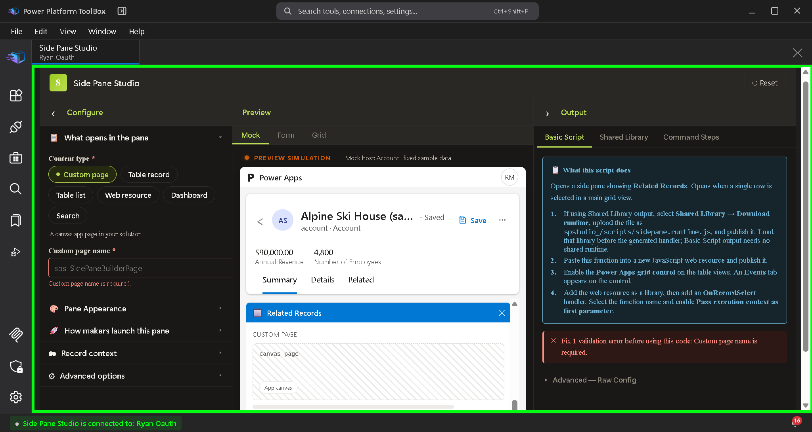
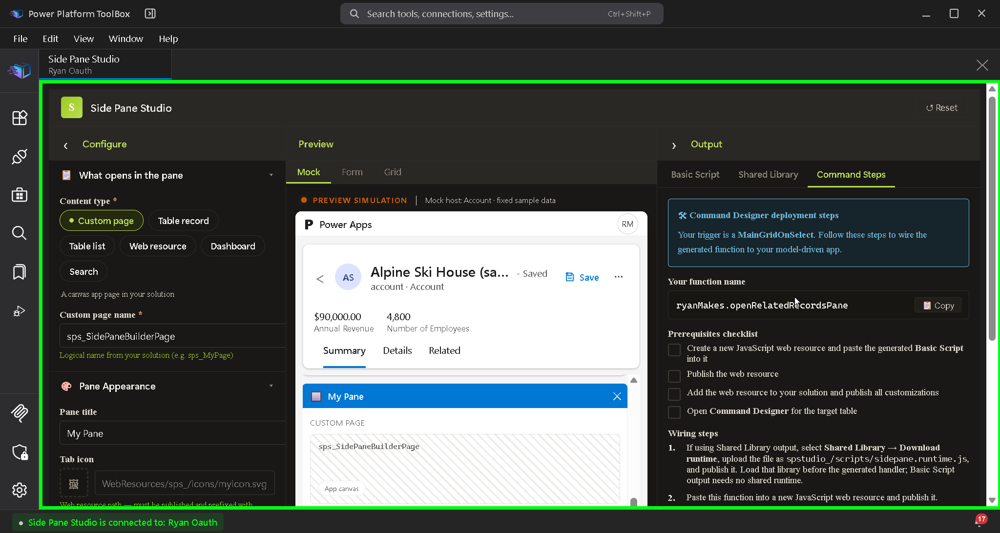

# Side Pane Studio User Instruction Manual

This manual assumes Power Platform ToolBox and Side Pane Studio are already installed. Start by selecting your Dataverse connection, then configure, preview, and deploy a side pane. The steps cover Side Pane Studio 1.1.1.

For installation and local development, see [How-To-Build.md](../How-To-Build.md). A shorter workflow is in [usage.md](usage.md).

## Step 1: Confirm ToolBox and the active connection

**Objective**: ToolBox is running and a Dataverse environment is the active connection.

**Actions**:

1. Launch Power Platform ToolBox.
2. In **Connections**, select the environment that contains the model-driven app you will test.
3. Leave that connection active.

**Explanation**:

- Side Pane Studio reads the active ToolBox connection. Table pickers, dashboards, form XML, and the shared-runtime check all use that environment.
- Switching or deleting the connection reloads the studio session. A removed connection stops the workbench until you connect again.

**Verification**:

The Connections panel shows your environment as the active connection.

Expected output: the environment name you chose is selected, and opening Side Pane Studio does not stop on **Connection unavailable**.

## Step 2: Launch Side Pane Studio

**Objective**: the studio is open against the active environment.

**Actions**:

1. Click **Tools** or **Installed Tools**.
2. Click **Side Pane Studio**.
3. Wait until the header and the three panels (or the three tabs) appear.

**Explanation**:

- The first launch can ask for permission consent. That consent is stored for this tool until a later version asks for more.
- A loading state reads **Connecting to Dataverse…** while the connection check runs.

**Verification**:

The header shows **Side Pane Studio** and a **Reset** button.

Expected output: the workbench is interactive. The center preview is on the **Mock** tab.

## Step 3: Confirm the default pane

Work in the ToolBox window with Side Pane Studio open. On a wide window you get three columns: **Configure** (left), **Preview** (center), and **Output** (right). Below 900 pixels, use the **Configure**, **Preview**, and **Output** tabs instead. The steps use the same fields either way.

The studio writes the current configuration to ToolBox settings and restores it the next time you open the tool. **Reset** in the header asks you to confirm `Reset all configuration? This cannot be undone.` and then restores the defaults below.

| Setting             | Default                                |
| ------------------- | -------------------------------------- |
| Content type        | Custom page                            |
| Custom page name    | `sps_SidePaneBuilderPage`              |
| Pane title          | Related Records                        |
| Pane ID             | `relatedRecordsPane`                   |
| Width               | 480 (allowed range 300–1200)           |
| Trigger             | Command bar button (form)              |
| Function            | `YourNamespace.openRelatedRecordsPane` |
| Context             | Current record (from trigger)          |
| Reuse open pane     | On                                     |
| Expand pane on open | On                                     |

**Objective**: you can see the default custom-page pane in the preview before you change anything.

**Actions**:

1. In **Configure**, open **What opens in the pane**.
2. Confirm **Custom page** is selected and **Custom page name** is `sps_SidePaneBuilderPage`.
3. Look at the center **Mock** preview.

**Explanation**:

- **Custom page** opens a canvas page that already lives in the solution. The name is the page logical name, not the display name.
- The mock host is a fixed Account sample. It shows the pane title, width, and header so you can judge the layout. It does not load your custom page.



**Verification**:

The mock pane title is **Related Records**. The Output panel **Basic Script** tab shows a summary that starts with “Opens a side pane showing **Related Records**” and a **Copy** control on the script.

Expected output: no red validation callout on **Basic Script**. The script block is visible.

## Step 4: Point the pane at your custom page

**Objective**: the generated script targets a custom page in your solution.

**Actions**:

1. Stay on **What opens in the pane**.
2. Leave **Content type** on **Custom page**.
3. Replace the custom page name with your page logical name, `YOUR_CUSTOM_PAGE`.

**Explanation**:

- `YOUR_CUSTOM_PAGE` is the logical name from the solution, for example `contoso_relatedrecords`. An empty name cannot generate a usable script.
- Other content types replace these fields. Use them when the pane should show Dataverse data or another host page:
  - **Table record** — a record form. Optional form id, tab name, and a JSON object in **Form data**.
  - **Table list** — a view. Optional view and view type (`savedquery` or `userquery`).
  - **Web resource** — an HTML or JavaScript web resource. The page inside the pane cannot use `Xrm` or `parent.Xrm`.
  - **Dashboard** — a system or personal dashboard you pick from the environment.
  - **Search** — global search, with optional search text. The studio warns that search is not a documented `navigateTo` page type.

**Verification**:

**Custom page name** shows `YOUR_CUSTOM_PAGE`. **Basic Script** still shows the code block.

Expected output: the summary still describes the pane title, and there is no callout that says `Custom page name is required.`

## Step 5: Set the pane title, icon, and width

**Objective**: the pane’s label and size match the app you are designing.

**Actions**:

1. Open **Pane Appearance**.
2. Set **Pane title** to the label users should see, for example `Related Records`.
3. Leave **Tab icon** empty, or set a published web-resource path such as `WebResources/YOUR_PUBLISHER_/icons/YOUR_ICON.svg`.
4. Set **Width** between 300 and 1200. The field hint recommends 400–600. The default 480 is a solid start.
5. Leave **Show close button** on and **Hide header bar** off for this first pane.

**Explanation**:

- Width is stored in pixels. Values outside 300–1200 are rejected.
- An icon path renders in the model-driven app after that web resource is published. The preview keeps a placeholder and says: `Icon will render in the live app once the web resource is published. Showing placeholder in preview.`
- **Hide header bar** also hides the close button. If both **Hide header bar** and **Show close button** are on, the studio warns and the generated script emits `canClose: false`.

**Verification**:

The mock pane shows your title, and the width hint shows the pixel value you set.

Expected output: **Output** does not report `Pane width must be between 300 and 1200 pixels.`

## Step 6: Choose how makers launch the pane

**Objective**: the script is shaped for a form command-bar button, with a stable pane id and a function name you can select in Command Designer.

**Actions**:

1. Open **How makers launch this pane**.
2. Set **Trigger type** to **Command bar button (form)**.
3. Set **Unique pane ID** to a stable key, `YOUR_PANE_ID`. Use letters, numbers, and no quotes. Example: `relatedRecordsPane`.
4. Set **Function name** to `YOUR_FUNCTION_NAME`, for example `openRelatedRecordsPane`.
5. Set **Namespace** to `YOUR_NAMESPACE`, for example `Contoso`.

**Explanation**:

- The function makers wire up is `YOUR_NAMESPACE.YOUR_FUNCTION_NAME`. The field hint shows that full name while you type.
- Keep the pane id stable if later buttons should reuse this pane instead of creating a second one.
- The other triggers change the script shape and the deploy steps:

| On-screen trigger            | When it runs                                  | Extra field             |
| ---------------------------- | --------------------------------------------- | ----------------------- |
| Form on load                 | The record form loads                         | —                       |
| Command bar button (form)    | A form command-bar button                     | —                       |
| Command bar button (grid)    | A main-grid command                           | —                       |
| Command bar button (subgrid) | A subgrid command                             | —                       |
| Row select (grid)            | One row is selected in the main grid          | Power Apps grid control |
| Row select (subgrid)         | One row is selected in a subgrid              | Power Apps grid control |
| Console / Manual             | You paste the script into the browser console | No namespace field      |
| Field on change              | A form field changes                          | **Field name**          |
| Lookup tag click             | A lookup tag is clicked                       | **Lookup control name** |

**Verification**:

The function hint reads `YOUR_NAMESPACE.YOUR_FUNCTION_NAME`.

Expected output: **Basic Script** is still visible, and there is no `Pane ID is required.` error.

## Step 7: Set record context

**Objective**: the custom page receives the record that is open on the form.

**Actions**:

1. Open **Record context**.
2. Set **Context mode** to **Current record (from trigger)**.
3. Set **Table name** to the logical name of the form’s table, `YOUR_TABLE_LOGICAL_NAME`, for example `account`.
4. Leave **Reuse open pane** on.

**Explanation**:

- **Current record (from trigger)** uses the form record when the trigger is a form load, form button, field change, or similar form event.
- For a custom page or web resource, an empty **Table name** omits record context. The pane still opens, with no record. The studio says: `Without a table name the generated script omits record context entirely — the pane opens with no record.`
- **Selected row (subgrid)** is valid for main-grid and subgrid triggers. On any other trigger the studio blocks generation with: `Selected row context is only available from a main grid or subgrid. Choose a different context mode or trigger.`
- **Static record ID** embeds a GUID. That GUID belongs to one environment. Reconfigure it after you import the setup somewhere else.
- **None — pane opens independently** sends no record.
- **Reuse open pane** navigates the existing pane to the new page and then selects it. Turning it off closes and recreates the pane when it is already open.
- **Lookup tag click** is special: for a custom page or table record, the clicked tag supplies `entityType` and `id` at runtime. The context mode you picked stays selected in the form, and the tag identity wins when the script runs.

**Verification**:

**Table name** shows `YOUR_TABLE_LOGICAL_NAME`. The info callout about a missing table name is gone.

Expected output: **Basic Script** remains available. Context errors, if any, name the field to change.

## Step 8: Check behavior, then preview

**Objective**: the pane opens in the foreground, and the preview matches the title and width you set.

**Actions**:

1. Open **Advanced options**.
2. Leave **Open in foreground (isSelected)** on.
3. Leave **Expand pane on open** on.
4. Leave **Close other side panes** off for this first pane.
5. Leave **Initial badge value** at `0`.
6. Return to the center preview. Stay on **Mock**.
7. If you configured a table, you can also open **Form** to preview with environment metadata. **Grid** appears when the target is a table list.

**Explanation**:

- **Expand pane on open** expands the side-pane rail after a command-bar trigger creates the pane.
- **Close other side panes** closes every other open pane after this one opens. The Output panel then shows: `closeOthers is active: The generated script closes all other side panes after opening this one.`
- **Keep loaded when inactive** (`alwaysRender`) keeps the pane in memory when the user switches away. The studio warns about that memory cost. Leave it off unless you have measured a need.
- **Form** preview uses a host form picker that is independent of the form id on a table-record target. **Mock** metadata can show a configured list `viewId` or a record `formId` and tab name. Neither preview is a live navigation test.
- Warnings do not block copy. Errors do. While any error exists, the script block is hidden and the panel says `Fix N validation error(s) before using this code:` followed by the first error.

**Verification**:

The mock pane title and width match Configure. **Basic Script** shows the code block.

Expected output: zero validation errors on the Output panel. Warnings, if you turned any on, appear as amber callouts and the script remains copyable.

## Step 9: Copy the Basic Script and read the deploy steps

**Objective**: you have the script on the clipboard and the Command Designer steps for a form button.

**Actions**:

1. Open the **Output** panel.
2. Stay on **Basic Script**.
3. Read **What this script does** and the numbered steps under it.
4. Click **Copy** on the code block.
5. Open the **Command Steps** tab and copy the function name if you need it again. For this trigger it is `YOUR_NAMESPACE.YOUR_FUNCTION_NAME`.

**Explanation**:

- **Basic Script** is self-contained. You do not upload the shared runtime for this path.
- **Shared Library** is a shorter script that calls a deployed helper. Skip it until the advanced section.
- **Command Steps** repeats the deploy list and shows the function name with its own **Copy** control.
- **Advanced — Raw Config** is the saved configuration as JSON for diagnostics. Copy it only when you are debugging the configuration, not when you are wiring the button.
- For **Command bar button (form)** the deploy steps in the product are:
  1. If you are using Shared Library output, download the runtime, upload it as `spstudio_/scripts/sidepane.runtime.js`, publish it, and load that library before the handler. Basic Script does not need that file.
  2. Paste the function into a new JavaScript web resource and publish it.
  3. Add the web resource to your solution and publish all customizations.
  4. Wire the function in **Command Designer**. In Action parameters, add `primaryControl` (Primary Control type) as the first argument.



**Verification**:

**Copy** on the code block switches to **Copied!**

Expected output: the clipboard holds the full Basic Script, and Command Steps shows your function name. If the browser blocks the clipboard, Command Steps says `Clipboard access blocked. Select the text below and copy manually (Ctrl+C / Cmd+C).`

## Step 10: Publish the web resource and test the button

**Objective**: the form command opens the pane in the model-driven app.

**Actions**:

1. In your solution, create a JavaScript web resource, paste the Basic Script, and publish the web resource.
2. Open **Command Designer** for `YOUR_TABLE_LOGICAL_NAME`, on the main form command bar.
3. Add a button. Set the action to run JavaScript.
4. Select the web resource as the library.
5. Set the function to `YOUR_NAMESPACE.YOUR_FUNCTION_NAME`.
6. Add an action parameter named `primaryControl` of type **Primary Control**, as the first parameter.
7. Save and publish the app customizations.
8. Open a record of `YOUR_TABLE_LOGICAL_NAME` in the model-driven app and click the button.

**Explanation**:

- `primaryControl` is how the generated form-button function receives the form. Command Designer must pass it. The generated function is `function(primaryControl)`.
- Play the app in the same environment ToolBox used, unless you intentionally reconfigured static ids for another environment.
- The pane id `YOUR_PANE_ID` is what the script reuses on the next click when **Reuse open pane** is on.

**Verification**:

Click the new command. The side pane opens with your title and your custom page.

Expected output: one pane, about the width you set, titled with your pane title. A second click reuses that pane. If the button does nothing, compare the published function name with Command Steps before you change the script.

## Troubleshooting

Messages below are the text the studio shows. Fix the first error in the Output callout, then copy again. Warnings stay visible and still allow **Copy**.

**Error 1: Dataverse API + Toolbox API unavailable**

Full error message:

```text
Dataverse API + Toolbox API unavailable
Open this tool inside a Power Platform Toolbox (PPTB) environment connected to Dataverse.
```

The same screen names whichever API is missing, for example `Toolbox API unavailable`.

Cause: the page is open outside ToolBox, so `toolboxAPI` and `dataverseAPI` are not on the page.

Solution:

1. Close the browser tab or local dev window.
2. Start Power Platform ToolBox.
3. Launch **Side Pane Studio** from **Installed Tools**.

Verify the fix: the header **Side Pane Studio** and the **Mock** preview appear.

**Error 2: No active Dataverse connection**

Full error message:

```text
Connection unavailable
No active Dataverse connection. Connect an environment in PPTB and retry.
```

Related messages from the same screen:

```text
toolboxAPI unavailable — open inside PPTB.
```

```text
Connection removed. Reconnect in PPTB.
```

Cause: ToolBox has no selected connection, the connection check failed, or the active connection was deleted while the studio was open.

Solution:

1. Open **Connections** in ToolBox.
2. Select the environment, or click **Add Connection** and finish **Microsoft Login Prompt** sign-in.
3. Launch Side Pane Studio again.

Verify the fix: the workbench replaces **Connection unavailable**. If you had deleted the connection, the studio stays on `Connection removed. Reconnect in PPTB.` until a connection exists again.

**Error 3: Custom page name is required**

Full error message:

```text
Fix 1 validation error before using this code: Custom page name is required.
```

Cause: **Content type** is **Custom page** and **Custom page name** is blank. The same pattern is `Web resource name is required.`, `Table name is required.`, and `Dashboard is required.` for those content types.

Solution:

1. Open **What opens in the pane**.
2. Enter `YOUR_CUSTOM_PAGE`, or switch to the content type you actually want and fill its required field.
3. Return to **Basic Script**.

Verify the fix: the code block replaces the error callout.

**Error 4: Pane ID is required, or the width is out of range**

Full error message:

```text
Pane ID is required.
```

```text
Pane width must be between 300 and 1200 pixels.
```

Cause: **Unique pane ID** is empty, or **Width** is below 300 or above 1200.

Solution:

1. Open **How makers launch this pane** and set **Unique pane ID** to `YOUR_PANE_ID`.
2. Open **Pane Appearance** and set **Width** between 300 and 1200.

Verify the fix: **Basic Script** shows the code block, and the width hint shows the new pixel value.

**Error 5: Selected row context is only available from a grid**

Full error message:

```text
Selected row context is only available from a main grid or subgrid. Choose a different context mode or trigger.
```

Cause: **Context mode** is **Selected row (subgrid)** while the trigger is a form, field, lookup, or console action. Those triggers have no grid selection.

Solution:

1. For a form button, set **Context mode** back to **Current record (from trigger)**.
2. Or change **Trigger type** to **Command bar button (grid)**, **Command bar button (subgrid)**, **Row select (grid)**, or **Row select (subgrid)**.

Verify the fix: the context error disappears from **Basic Script**.

**Error 6: Console / Manual has no current record**

Full error message:

```text
Console / Manual scripts run outside a form or grid, so there is no current record. Use Static record ID or None.
```

Cause: **Trigger type** is **Console / Manual** and **Context mode** is still **Current record (from trigger)**.

Solution:

1. Set **Context mode** to **None — pane opens independently** when the page does not need a record.
2. Or set **Context mode** to **Static record ID**, choose the table, and paste the record GUID from that environment.

Verify the fix: **Basic Script** shows an `async function` you can paste into the console. Command Steps then says to open the model-driven app, press F12, and paste into the Console tab.

**Error 7: A valid record ID (GUID) is required**

Full error message:

```text
A valid record ID (GUID) is required — this trigger and context supply no record at runtime.
```

Cause: the target is **Table record**, and the trigger or context does not supply a record. That happens for **Static record ID**, **None**, or **Console / Manual** when **Record ID** is empty or is not a GUID. **Lookup tag click** is the exception: the tag carries the id.

Solution:

1. Paste a GUID into **Record ID**, including the hyphens, from the environment you will test.
2. Or switch **Context mode** to **Current record (from trigger)** and use a form trigger.
3. Or switch the target to **Custom page** or **Table list** if you do not need one record.

Related field errors use the same fix path:

```text
Form ID must be a valid GUID.
```

```text
View ID must be a valid GUID.
```

```text
Form data must be a JSON object.
```

```text
Select a view type when a view ID is set.
```

Verify the fix: **Basic Script** shows the code block. For a static id, expect the warning `Static record IDs are environment-specific. You must reconfigure this field after deploying to another environment.`

### Error 8: Shared runtime is not in the environment

Full error message:

```text
Prerequisite not detected: The shared runtime library (spstudio_/scripts/sidepane.runtime.js) is not deployed in this environment. Deploy it before using this output.
```

Cause: you opened **Shared Library**, and the web resource `spstudio_/scripts/sidepane.runtime.js` is not in the active environment. **Basic Script** does not need this file.

Solution:

1. Prefer **Basic Script** until you have a reason to share one runtime across panes.
2. If you do want the shared library, stay on **Shared Library**, click **Download runtime**, and upload that file as the web resource `spstudio_/scripts/sidepane.runtime.js`.
3. Publish it, then add it as a library that loads before the generated handler.

Verify the fix: reopen **Shared Library**. The callout changes to `Shared runtime library detected in this environment.`

A failed check says `Could not verify prerequisite:` plus the Dataverse error. Reconnect the environment and open the tab again. A failed save says `Could not download runtime:` plus the reason. Retry **Download runtime**. Inside ToolBox the button uses the ToolBox save dialog. The button label is **Saving runtime...** while the save is in progress.

## Advanced Topics

**Direction 1: Shared library runtime** | Difficulty: Intermediate

**Basic Script** inlines the open logic. **Shared Library** emits a short handler that calls `SidePaneHelper` in `spstudio_/scripts/sidepane.runtime.js`. Use the shared file when many panes should share one published helper and you are willing to load that library before every handler. Download it from **Shared Library → Download runtime**, upload it under that exact name, and publish it. The handler web resource still has to be wired to the trigger.

Recommended resources:

- This manual, [Error 8](#error-8-shared-runtime-is-not-in-the-environment) (documentation)
- [Power Platform ToolBox tool installation](https://docs.powerplatformtoolbox.com/tool-installation) (documentation)

**Direction 2: Lookup tag click** | Difficulty: Intermediate

**Lookup tag click** cancels the lookup’s default navigation and opens the pane for the tag that was clicked. Set **Lookup control name** to the control logical name, such as `parentaccountid`. Put the generated script in a web resource, then register it from the form **OnLoad** handler. The generated script includes the registration line:

```javascript
formContext
  .getControl("parentaccountid")
  .addOnLookupTagClick(Contoso.openRelatedRecordsPane);
```

Use `getControl`, not `getAttribute`. The lookup event passes execution context. The handler calls `preventDefault()` and reads the tag with `getTagValue()`. For a custom page or table record, the tag’s type and id override **Current record**, **Static record ID**, and **None** when the script runs. An empty control name produces `Lookup control name is required for LookupTagClick triggers.`

Recommended resources:

- [FormContext.getControl](https://learn.microsoft.com/en-us/power-apps/developer/model-driven-apps/clientapi/reference/formcontext/getcontrol) (documentation)
- [addOnLookupTagClick](https://learn.microsoft.com/en-us/power-apps/developer/model-driven-apps/clientapi/reference/controls/addonlookuptagclick) (documentation)

**Direction 3: Grid commands and row select** | Difficulty: Intermediate

**Command bar button (grid)** and **Command bar button (subgrid)** pass `primaryControl` and read the first selected row. With no selection, the generated script returns without opening a pane. Extra selected rows are ignored. **Row select (grid)** and **Row select (subgrid)** require the **Power Apps grid control**. After you enable it, the control shows an **Events** tab. Add the web resource, add an **OnRecordSelect** handler, pass execution context, and select `YOUR_NAMESPACE.YOUR_FUNCTION_NAME`.

**Selected row (subgrid)** on a subgrid button warns: `The generated script uses the first selected row. It exits without opening a pane when no row is selected, and ignores rows beyond the first.` A main-grid button aimed at a **Table record** warns with the same first-row behavior.

Recommended resources:

- [Grid OnRecordSelect](https://learn.microsoft.com/en-us/power-apps/developer/model-driven-apps/clientapi/reference/events/grid-onrecordselect) (documentation)
- [Command designer](https://learn.microsoft.com/en-us/power-apps/maker/model-driven-apps/command-designer-overview) (documentation)

**Direction 4: Table lists, record forms, and dashboards** | Difficulty: Intermediate

**Table list** can pin a view id and a view type of `savedquery` (system view) or `userquery` (personal view). **Table record** can pin a form id, a tab name, and **Form data**. Form data must be one JSON object, for example:

```json
{
  "name": "Contoso",
  "description": "Opened from the side pane.",
  "donotemail": 1
}
```

**Dashboard** stores the dashboard id you pick. The picker lists dashboards from the active environment. If the list fails, the field shows `Could not load dashboards`.

Recommended resources:

- [navigateTo pageInput](https://learn.microsoft.com/en-us/power-apps/developer/model-driven-apps/clientapi/reference/xrm-navigation/navigateto) (documentation)
- [sidePanes](https://learn.microsoft.com/en-us/power-apps/developer/model-driven-apps/clientapi/reference/xrm-app/sidepanes) (documentation)

**Direction 5: Metadata table filters** | Difficulty: Advanced

**Advanced options → Metadata table filters** limits which tables the pickers load. Saving uses ToolBox settings when that API is available. If settings cannot be saved, the field shows the save error. Reset restores the default filter. A table that drops out of the accessible set produces a warning, not a hard stop: `Table "YOUR_TABLE_LOGICAL_NAME" is no longer accessible in this app or for the current user.`

Recommended resources:

- [Dataverse table privileges](https://learn.microsoft.com/en-us/power-platform/admin/security-roles-privileges) (documentation)

### Hands-on projects

1. **Related records button** — A form command on Account opens your custom page at 480 pixels with **Reuse open pane** on. Uses custom page, form button, current record, and Command Designer.
2. **Contact list for the open account** — Change the target to **Table list**, table `contact`, and pass the current account through context. Uses table list, view id, and current-record context.
3. **Lookup tag opens the account** — On a contact form, **Lookup tag click** for `parentcustomerid` opens that account as a **Table record**. Uses lookup registration from OnLoad and tag identity.

### Best practices

- Publish and click the real button in the model-driven app. The mock, form, and grid previews do not create a side pane. The studio cannot create panes inside ToolBox.
- Treat warnings as design notes. `alwaysRender`, a hidden header, static GUIDs, and the search target all generate script and all need a deliberate choice.
- Keep pane ids stable and unique inside the app. Reuse depends on that id.
- Prefer **Basic Script** for a single pane. Add `spstudio_/scripts/sidepane.runtime.js` only when several handlers share it, and load it first.
- Give users read access to the tables the pane shows. The studio can only list tables and dashboards the signed-in user can read.
- Reconfigure **Static record ID** after every environment move. Do not look up a production GUID in a sandbox and leave it in the script.
- Keep **Hide header bar** off unless you have another way for the user to dismiss the pane. The generated script turns `canClose` off when the header is hidden.

## Cheatsheet

### Environment Info

| Item                        | Command / path                                                                       |
| --------------------------- | ------------------------------------------------------------------------------------ |
| Marketplace name            | Side Pane Studio                                                                     |
| Package                     | `@ryanmakes/side-pane-studio`                                                        |
| Version                     | 1.1.1                                                                                |
| Shared runtime web resource | `spstudio_/scripts/sidepane.runtime.js`                                              |
| Wide layout                 | Window width ≥ 900 px                                                                |
| Pane width                  | 300–1200 px, default 480                                                             |
| Saved configuration         | ToolBox settings key `lastConfig`                                                    |

### Common Commands

| Action           | Where                                                  | Description                      |
| ---------------- | ------------------------------------------------------ | -------------------------------- |
| Open the studio  | ToolBox → Installed Tools → Side Pane Studio           | Needs an active connection       |
| Restore defaults | Header → **Reset** → confirm                           | Clears `lastConfig`              |
| Copy the script  | Output → **Basic Script** → **Copy**                   | Self-contained handler           |
| Deploy steps     | Output → **Command Steps**                             | Function name plus wiring        |
| Download helper  | Output → **Shared Library** → **Download runtime**     | Only for the shared-library path |
| Raw JSON         | Output → **Advanced — Raw Config**                     | Diagnostics                      |
| Console test     | Trigger **Console / Manual**, then F12                 | Paste the whole block            |

### Common Code Snippets

Form command function name to enter in Command Designer:

```javascript
Contoso.openRelatedRecordsPane;
```

Command Designer first action parameter:

```text
primaryControl    Primary Control
```

Lookup tag registration, placed on the form OnLoad handler. Replace the control name and the function:

```javascript
formContext
  .getControl("parentaccountid")
  .addOnLookupTagClick(Contoso.openRelatedRecordsPane);
```

Form data for a **Table record** target. One JSON object:

```json
{
  "name": "Contoso",
  "description": "Opened from the side pane."
}
```

Shared runtime web resource name:

```text
spstudio_/scripts/sidepane.runtime.js
```

### Quick Troubleshooting

| Symptom                                                             | Possible cause                     | Quick fix                                                           |
| ------------------------------------------------------------------- | ---------------------------------- | ------------------------------------------------------------------- |
| Dataverse API + Toolbox API unavailable                             | Opened outside ToolBox             | Launch from Installed Tools                                         |
| No active Dataverse connection                                      | Nothing selected in Connections    | Add or select a connection                                          |
| Connection removed. Reconnect in PPTB.                              | Active connection deleted          | Connect again, reopen the studio                                    |
| Custom page name is required.                                       | Blank custom page                  | Fill `YOUR_CUSTOM_PAGE`                                             |
| Pane ID is required.                                                | Blank pane id                      | Set `YOUR_PANE_ID`                                                  |
| Pane width must be between 300 and 1200 pixels.                     | Width out of range                 | Set 300–1200                                                        |
| Selected row context is only available from a main grid or subgrid. | Selected row on a form trigger     | Use Current record, or switch to a grid trigger                     |
| Console / Manual scripts run outside a form or grid…                | Manual trigger plus current record | Use None or a static GUID                                           |
| A valid record ID (GUID) is required…                               | Table record with no runtime id    | Paste a GUID or use a form trigger                                  |
| Prerequisite not detected: `spstudio_/scripts/sidepane.runtime.js`  | Shared Library without the helper  | Use Basic Script, or upload the runtime                             |
| Clipboard access blocked.                                           | Browser clipboard permission       | Select the text and copy with Ctrl+C or Cmd+C                       |
| Could not load dashboards                                           | Metadata call failed               | Check the connection and dashboard privilege                        |
| Button does nothing in the app                                      | Function or parameter mismatch     | Match `YOUR_NAMESPACE.YOUR_FUNCTION_NAME` and pass `primaryControl` |

## Appendix

### Glossary

| Term                   | Definition                                                                                                  |
| ---------------------- | ----------------------------------------------------------------------------------------------------------- |
| Basic Script           | Self-contained JavaScript on the Output panel. Does not need the shared runtime.                            |
| Command Designer       | Model-driven app designer where a command runs a JavaScript function.                                       |
| Context mode           | Where the record id comes from: current form record, selected grid row, a fixed GUID, or nowhere.           |
| Custom page            | Canvas page in a solution, opened by its logical name.                                                      |
| Dataverse              | The environment that holds tables, pages, dashboards, and web resources.                                    |
| Logical name           | The schema name of a table, column, or control, such as `account` or `parentaccountid`.                     |
| Pane ID                | Stable key the script uses to find or reuse one side pane.                                                  |
| Power Platform ToolBox | Desktop host that connects to Dataverse and runs Side Pane Studio.                                          |
| primaryControl         | First argument Command Designer passes into a command-bar function so the script can read the form or grid. |
| Shared Library         | Shorter generated handler that calls `SidePaneHelper` in the runtime web resource.                          |
| Side pane              | Panel docked beside a model-driven app page.                                                                |
| Web resource           | A file stored in Dataverse. JavaScript web resources hold the generated handler.                            |

### Reference links

- [Side Pane Studio basic usage](usage.md)
- [Power Platform ToolBox quick start](https://docs.powerplatformtoolbox.com/quickstart)
- [ToolBox authentication](https://docs.powerplatformtoolbox.com/authentication)
- [Xrm.App.sidePanes](https://learn.microsoft.com/en-us/power-apps/developer/model-driven-apps/clientapi/reference/xrm-app/sidepanes)
- [navigateTo](https://learn.microsoft.com/en-us/power-apps/developer/model-driven-apps/clientapi/reference/xrm-navigation/navigateto)
- [Command designer](https://learn.microsoft.com/en-us/power-apps/maker/model-driven-apps/command-designer-overview)
- [addOnLookupTagClick](https://learn.microsoft.com/en-us/power-apps/developer/model-driven-apps/clientapi/reference/controls/addonlookuptagclick)
- [Grid OnRecordSelect](https://learn.microsoft.com/en-us/power-apps/developer/model-driven-apps/clientapi/reference/events/grid-onrecordselect)
